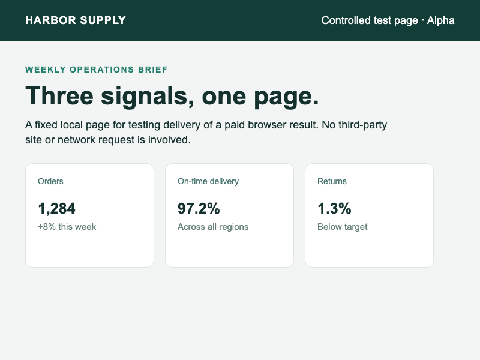

# Recover one paid MPP result after its response disappears

The [baseline probe](../mpp-response-loss-2026-10-01/README.md) paid USD 0.50 with a Stripe test-mode SPT, saved the merchant result, then reset the buyer's TCP connection before forwarding the paid response. The buyer got neither result nor receipt, and reusing its spent credential returned 402. This reference merchant adds an operation ID **before payment** and an authenticated result lookup. It renders a controlled page in Chrome after payment, saves the PNG-bearing result, then suffers the same reset. The original buyer recovered the exact screenshot and receipt after both buyer and merchant processes restarted, without another payment credential.



| Observable outcome | Minimal paid route | Operation/result recipe |
|---|---:|---:|
| First paid response lost after merchant saved result | Yes | Yes |
| Buyer has artifact/receipt immediately | No | No |
| Buyer can retrieve original saved result | No endpoint | HTTP 200, matching artifact and receipt |
| Extra successful payment for that operation | No observed | No observed; one matching PI before a separate purchase |
| Different buyer with operation ID and input | No caller model | HTTP 404; no artifact or receipt |
| Changed input / route | Credential retry 402 | Result lookup 409 / 404 |
| Second intentional purchase with identical input | Not tested | New operation and new succeeded 50-cent PI |

The [manifest](manifest.json) pins mppx 0.9.2, Stripe SDK 22.6.2, Chrome 154, the Stripe sample SHA, tool versions, and source hashes. The [redacted trace](trace.json) records the state transitions (`created → payment_unknown → ready`), TCP-reset barrier, restarted recovery, PNG hash, ownership controls, and Stripe payment checks. Before the second intentional purchase, Stripe's complete run-window list held one matching MPP PaymentIntent. After it, the list held exactly the two intentional payments. The saved, recovered-receipt, and Stripe PaymentIntent hashes agree for the first operation; the saved screenshot hash matches the published PNG. Raw SPTs, buyer keys, merchant key, and plaintext PI IDs are absent from these published files.

Run this from the project root after [test-mode setup](../../../mpp/README.md):

```sh
.venv/bin/python scripts/mpp_recovery.py
```

It mints **two** separate USD 0.50-capped test SPTs: one for the lost-response operation and one to prove that an intentional same-input operation is a separate purchase. It starts the [reference merchant](../../../mpp/recovery_server.ts), [fault proxy](../../../mpp/response_loss_proxy.ts), and [scripted buyer](../../../mpp/recovery_buyer.ts), renders only a bundled local HTML page in Chrome, checks Stripe, and writes private logs under an ignored `results/mpp-recovery-*` directory. The recovery and different-buyer subprocesses receive no SPT; only the merchant and verification harness have the Stripe secret key. See the [adoption recipe](../../../mpp/RECOVERY.md) for the route contract and limits.

This is **merchant application guidance**, not a Stripe or mppx bug report. mppx intentionally rejects Stripe credential replay. The example uses local JSONL with `fsync` and test buyer keys to make the boundaries visible; replace both with production storage and authentication. A process crash after Stripe succeeds but before the merchant saves the result can leave `payment_unknown`. A [separate local state control](unknown-control.json) confirms that the original buyer gets 202 for both result lookup and attempted repayment, while another buyer gets 404; that control uses a synthetic unresolved record and makes **no Stripe call**. It is not a live crash-window test. The example does not reconcile that window or claim exactly-once execution. The screenshot is from a bundled local page, not a Kernel/Ramp integration or evidence about third-party browser services. Recovery and settled-response replay have prior art in other MPP integrations.
